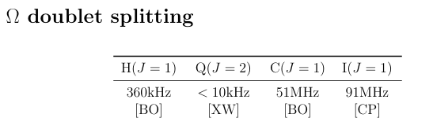
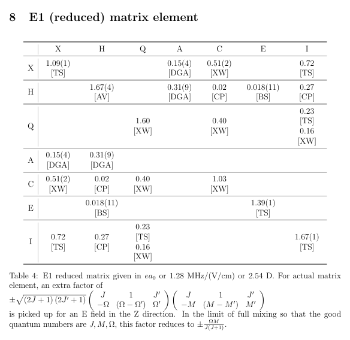

Code for generating Stark shift vs. Electric fields for 232ThO Molecules.

Stark Effect in selected Rotational levels for X, C, H, Q and I stats contained in ./images

Plots based on measurements result:

